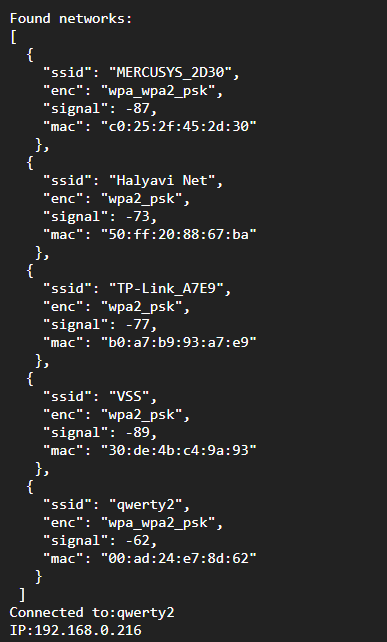

# ModuleMiddleWIFIesp8266
<p align="center">
  
</p>

-----------------

# Лицензия
////

# Описание
<div style = "font-family: 'Open Sans', sans-serif; font-size: 16px; color: #555">

Модуль предназначен для реализации логики WiFi соединения с использованием чипа [Esp8266](https://github.com/AlexGlgr/ModuleMiddleWIFIesp8266/blob/fork-Alexander/res/0a-esp8266ex_datasheet_en.pdf). Модуль автоматически проверяет присутствие в системе Espruino базовых модулей для работы с WiFi, что свидетельствует о встроеном в плату чипе, и, если модули отсутствуют, автоматически подключает базовый модуль для работы с периферийным чипом, с которым модуль работает по Serial интерфейсу. Модуль является неотъемлемой частью фреймворка EcoLite. Модуль работает в режиме синглтон. Модулю необходим конфигурационный файл с именем APs.json. Для корректной работы фреймворка необходимо создать глобальный объект с именем wifi. Модуль имеет следующие архитектурные решения фреймворка EcoLite:
- создаёт шину через глобальный объект [UARTbus](https://github.com/AlexGlgr/ModuleBaseI2CBus/blob/fork-Alexander/README.md);
- при проверке валидности данных использует ошибку класса [Error](https://github.com/Konkery/ModuleAppError/blob/main/README.md);
- при проверке переменной на целочисленное использует класс [NumIs](https://github.com/Konkery/ModuleAppMath/blob/main/README.md).

### **Конструктор**
Конструктор принимает пины *_rx* и *_tx*, которые используются для работы с периферийным чипом. В случае присутствия на плате встроенного чипа передаваемые поля не будут использованы и их можно оставить пустыми. Для работы необходим конфигурациооный файл, содержащий SSID и пароль сети, к которой необходимо подключится. Пример файла конфигурациооного файла APs.json:
```json
[
    {
        "ssid":"ssid",
        "pass":"password"
    }
]
```

### **Поля**
- <mark style="background-color: lightblue">_name</mark> - имя класса в строковом виде;
- <mark style="background-color: lightblue">_wifi_</mark> - объект базового класса, непосредственно работающего с чипом;
- <mark style="background-color: lightblue">_bus</mark> - Serial шина для работы с периферийным чипом;
- <mark style="background-color: lightblue">_ssid</mark> - ssid сети, к которой осуществляется подключение;
- <mark style="background-color: lightblue">_ip_</mark> - ip-адрес сети, к которой осуществляется подключение;

### **Методы**
- <mark style="background-color: lightblue">Init(_rx, _tx)</mark> - осуществляет соединение с wifi сетью, указанной в конфигурационном файле, если та существует;
- <mark style="background-color: lightblue">InitBus(_rx, _tx)</mark> - создаёт новую Serial шину для работы с периферийным чипом.
Вызывается внутри метода *Init()*, если отсутствует встроенный модуль WiFi.

### **Примеры**
Фрагмент кода для создание софтверной шины. Предполагается, что все необходимые модули уже загружены в систему:
```js
//Подключение необходимых модулей
const ClassWifi = require('ClassMiddleWIFIesp8266.min.js');
const ClassUARTBus = require ('ClassBaseUARTBus.min.js');

let UARTbus = new ClassUARTBus();
let wifi = new ClassWifi(B9, B10);

console.log(wifi);
```
Вывод созданнного объекта в консоль:
<p align="left">
  
</p>
</div>
